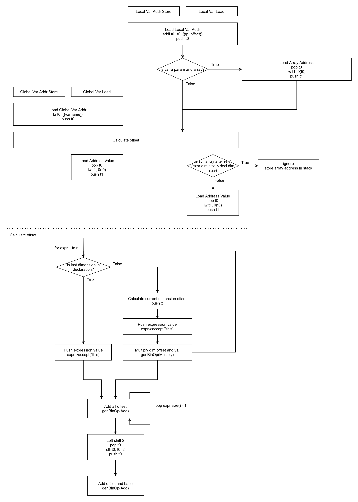

# 作業 5 報告

> 學生：鄭又愷
>
> 學號：0616330

## 作業 5 心得

### Restore Symbol Table

一開始會碰到的問題就是怎麼在 `CodeGenerator` 的 VP 中回覆先前建立的 Symbol Table。於是我將 `CompoundStatementNode`、`ForNode`、`FunctionNode`、`ProgramNode` 再繼承一個 class：`AstNodeWithSymTab`。

在第一次建立 symbol table 時，可以使用 `AstNodeWithSymTab::fillSymTab()` 回填 Symbol Table 的指標到 Node 中。

之後使用時，僅需 `AstNodeWithSymTab::getSymTab()` 即可再透過 `SymbolManager::pushScope()` 來還原 Symbol Table 的狀態。

### Store / Load?

接著遇到的一個問題是怎麼知道 Variable Reference 是 Load 還是 Store，我透過新增一個 enum class:

```cpp
enum class Side {
    LHS,
    RHS,
};
```

在 parse 過程即可將需要 load 或是 store 的資訊透過  `VariableReferenceNode::fillSide()` 填入，並在 code generation 的時候透過 `VariableReferenceNode::getSide()` 取得這個資訊。

### Local Variables

為了在 code generation 的時候就知道 local variables 在 stack 的位置，我在 `LocalConstSymbolEntry`、`LoopVarSymbolEntry`、`ParamSymbolEntry`、`LocalVarSymbolEntry` 這些 class 中新增了 `fp_offset` 的 attribute，並在實例化時填入這個資訊。

至於這先變數在 stack 中的位置，我透過 `SymbolFPManager` 維護，且每個 `SymbolTable` 中都包含一個 `const std::shared_ptr<SymbolFPManager> fp_mgr` 的指標。

使用指標的原因，是因為 `CompoundStatement` 會有一個新的 symbol table，但是 ABI 仍為之前的 function scope，因此使用指標即可在實例化時，拿先前 symbol table 的 `fp_mgr` 當作參數傳入建構子。

```cpp
class SymbolFPManager {
   public:
    SymbolFPManager();

    int getNextFpOffset(int bytes);
    int getNextParamFpOffset();

   private:
    int fp_offset = -20; // 0~-3: pc, -4~-7: fp, -8~-11: t0, -12~-15: t1, -16~-19: t2
    int param_count = 0;
    int param_spill_fp_offset = 0; // 1-4: param 9, 5-8: param 10
};
```

`SymbolFPManager::getNextFpOffset` 吃入的 bytes 參數，可以透過 `uint32_t TypeStruct::getDimBytes()` 獲取 Type 所需的大小。

### RODATA

處理 Real 與 String 時，因為是儲存在 `.rodata`，所以我在 `SymbolManager` 中新增了一些方法與維護每個值對應的 rodata symbol，在 code generation 時可以查這些表獲取資訊。

```cpp
class SymbolManager {
   public:
    ...

    void addRoData(float rval);
    void addRoData(std::string sval);
    std::string getRoDataIdentifier(float rval);
    std::string getRoDataIdentifier(std::string sval);
    std::unordered_map<std::string, std::string> getRealRoData();
    std::unordered_map<std::string, std::string> getStrRoData();

   private:
    ...

    int rodata_real_idx = 0;
    int rodata_str_idx = 0;
    std::unordered_map<std::string, std::string> rodata_real; // map to its id in assembly
    std::unordered_map<std::string, std::string> rodata_string; // map to its id in assembly
};
```

### Array

Array 算是卡最久的地方，還因此畫了一個流程圖釐清一些思路：



array 在宣告的 function scope 時，可以直接使用先前得到的 `fp_offset` 資訊。但是當作參數傳入函式時，需要先將該記憶體位址從參數載入，因此在計算 array offset 前會多了一個步驟。

> 若要實作指標應該也是要多是否為指標的檢查，但 spec 沒有實作指標因此沒有檢查

計算完 offset 後，若仍為 array，則繼續將該值 (記憶體位址) 儲存，不將記憶體中的值載入，若為值就將記憶體中的值讀出並 push 到 stack。

## 整學期編譯器作業心得

因為算是第二次寫，感覺比第一次寫上手了不少，而且這次挑戰用了純 C++ 來寫，感覺 code 看起來比第一次寫合理不少(?)

這次有提供 docker 的環境，自動測試腳本，github 的繳交及批改作業方式，問問題也比較公開透明，而且還用了潮潮的 RISC-V，覺得寫作業的體驗增加滿多的，很不錯。
